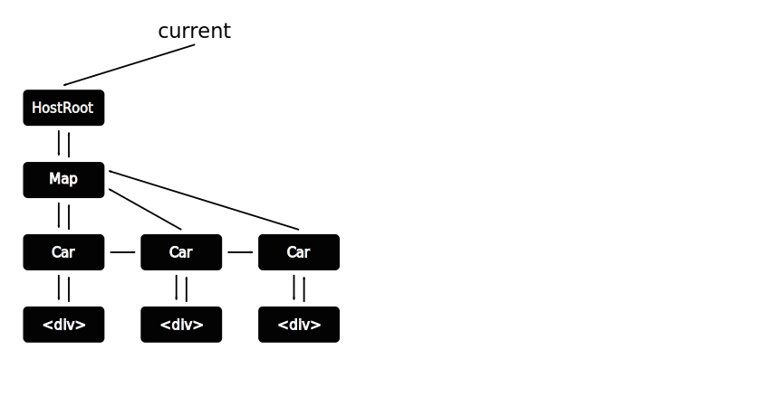
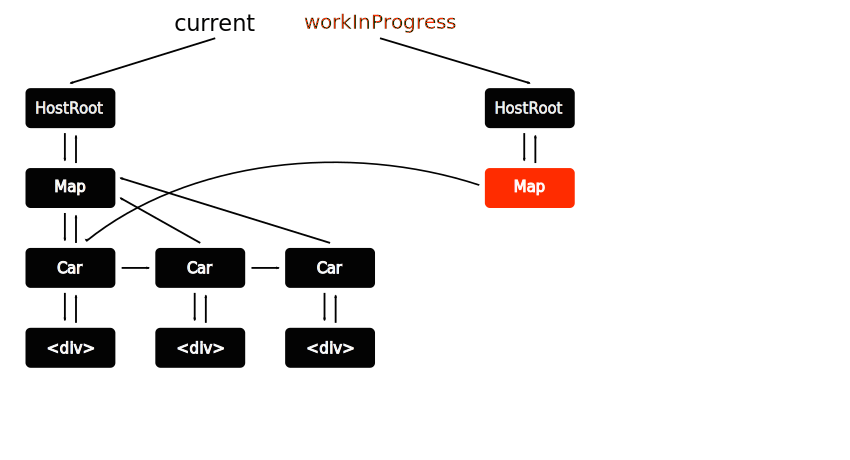
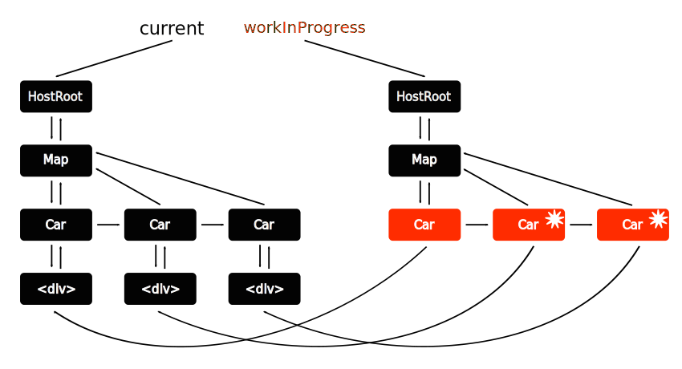
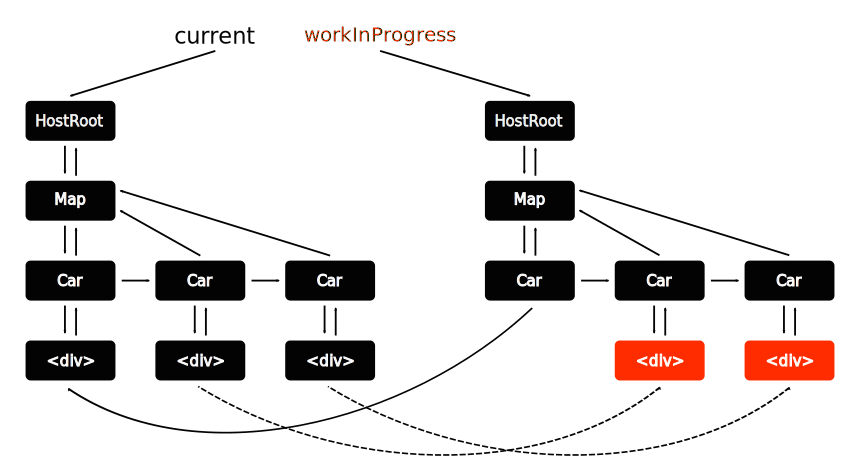
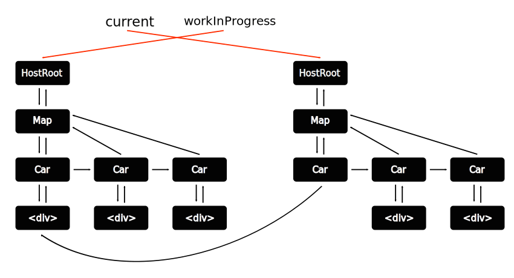
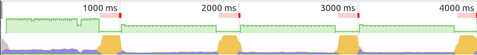
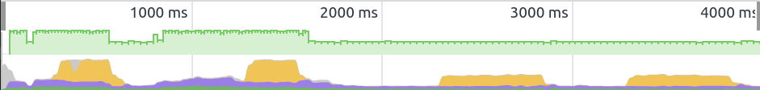

# React Next (fiber і далі)

Здрастуйте! Я [Євген Шемет](https://www.linkedin.com/in/yevhene/) - займаюсь розробкою близько 14 років, виступаю на конференціях, організовую IT мітапи, (CS50?),викладаю у ВНТУ. Одним словом, маю великий досвід в IT, а от статтю пишу вперше.  Тому буду радий вашим зауваженням та порадам у особистих повідомленнях або коментарях.
Поки я писав, React 16 вже [вийшов](https://facebook.github.io/react/blog/2017/09/26/react-v16.0.html). Але від цього інформація не стала менш актуальною.

## Fiber
Це нова архітектура, що покладена в основу React 16. Велика частина коду була переписана з нуля. Основною метою було створення можливості для пріоритизації оновлень. Також перероблена система обробки помилок та усунуті деякі старі незручності, наприклад, необхідність обгортати деілька елементів в один корінний елемент.  API, на щастя, майже не зачіпили.

## [Демо](https://present-fiber-demo.herokuapp.com/)
Розпочати знайомство краще всього з проблеми, яку має вирішити оновлення. Її добре видно на демо. Демо синтетичне, симулює щось накшталт екрану диспетчерської таксі. На карті міста жовті машини. На машинах чорні числа, що вказують скільки машині ще їхати до точки призначення. Числа змінюються кожної секунди, і під час цієї зміни, анімація підлагує. Відбувається це через те, що в аплікації виконується дві паралельні дії: обробка анімації та оновлення DOM. Анімація працює добре аж до поки не стається масоване оновлення DOM. Щоб проблему було краще видно введена штучна затримка, не забувайте що демо синтетичне. Але проблема цілком реальна: поки переобраховується DOM анімаціє не програється, через те що всі ресурси покладено на роботу з DOM. І в старій архітектурі React, цю проблему не можна було вирішити ажніяк. Треба віддати належне розробникам бібліотеки -  вони, зіткнувшись з цією проблемою, (майже) повністю переписали код.
Забігаючи наперед, скажу, що якщо натиснути на чекбокс зверху, демо переключиться в режим *fiber* і перестане гальмувати. (До речі, не залишайте демо надовго на самоті, бо воно казиться).

## Наразі
React, для забезпечення вискої швидкості роботи, виористовує технологію *Vitrual DOM*: В пам'яті підтримується спрощена копія DOM (Document Object Model), де за вузлами закріплені конкретні екземпляри (instance) компонентів, що ними керують. Коли змінюється стан екземпляру, відбувається процес оновлення, що складається з етапів:
- Компоненти опитуються щодо змін;
- DOM в пам'яті перебудовується;
- Обраховується різниця з реальним деревом DOM, та вносяться безпосередні зміни.
Зараз(вже не зараз а раніше?) для оновлення використовувався алгоритм, що його заднім числом назвали *Stack*. І в нього, з часом, виявився значний недолік: він працює простим пошуком в глибину і його робота неперервна. А оскільки в браузері все виконується в одному потоці, то під час оновлення, все інше має зачекати. В випаду високоприорітетних оновлень, наприклад анімаціі, це може стати відчутним клопотом для користувача.

## Новий алгоритм оновлення
Архітектура fiber названа на честь алгоритму, що лежить в її основі. Алгоритм полягає у розбитті процесу оновлення на дві фази:
1. Фаза *узгодження* (reconciliation) - коли виконуються переобрахунки компонентів і оновлення DOM в пам'яті;
2. Фаза *внеску* (commit) - коли виконується безпосереднє оновлення DOM.
Основним моментом є те що, фазу *узгодження* (reconciliation), можна переривати. *fiber* за допомогою [requestIdleCallback](https://developer.mozilla.org/ru/docs/Web/API/Window/requestIdleCallback), просить в браузера виділити час, в який він не буде завантажений роботою. При зворотньому виклику, браузер вказує скільки, власне, в нього є вільного часу. Це дає змогу *fiber*-у планувати частину оновлень на цей час. Якщо браузер не підтримує `requestIdleCallback`, то React робить *поліфіл* (polyfill).

Алгоритм *fiber* в свою чергу названий на честь найменшого об'єкта, що лежить в його основі. За кожним еземпляром (компонента чи елемента) закріплений такий об'єкт, що контролює його стан під час поточного оновлення та зв'язок з іншими компонентами.
```javascript
{
  stateNode
  return
  child
  sibling
  parent
}
```

## Процес оновлення виглядає наступним чином:
У нас є *поточне* (current) дерево компонентів та елементів, сформоване за допомогою об'єктів *fiber*. Стрілочки вниз це `child`, вверх `parent`, вправо `sibling`.


Створюється паралельне *робоче* (workInProgress) дерево, що частково складається зі старого дерева.


Визначаються компоненти, що мають зміни (позначені зірочками).


Дерево поступово розгортається, і на його основі створюється нове дерево. Там де є оновлення - клонуються елементи і вносяться зміни. Там де оновлень немає - використовуються існуючі елементи.


В результаті формується *внесок* (pending commit). Що, для застосування, очікує вже більшого проміжку часу, тому що фазу *внеску* переривати не можна.


Після того, як відбувається *внесок* (commit), *поточне* (current) дерево не знищується. Для єкономії часу, дерева просто міняються місцями. Це називається *подвійна буферизація* (double buffering).


## Застосування
Для того щоб відчути нові можливості необхідно застосувати режим *відкладених оновлень* `ReactDOM.unstable_deferredUpdates`. (Всі експериментальні можливості спочатку поставляються з префіксом `unstable_`).
```javascript
tick() {
  ReactDOM.unstable_deferredUpdates(() => (
    this.setState((prevState) => ({
      tick: prevState.tick + 1
    }))
  ))
}
```
Оновлення що відбуваються в рамках `deferredUpdates` відбуваються паралельно.
Зверніть увагу:
- Необхідно застосовувати `setState` з *зворотним викликом* (callback), `setState` з об'єктом стає *застарілим* (deprecated);
- Якщно новий стан буде залежати від поточного стану, то необхідно використовувати параметр зворотнього виклику `prevState`, замість `this.state`. Тому що він може бути викликаний декілька разів.

### Порівняння
Жовтим позначені оновлення, фіолетовим анімації, червоним лаги.

Stack:


Fiber:


## Також
Разом з новою архітектурою, при переписуванні React, були виправленні деякі, можливо, невеликі, але архітектурні помилки.

### Фрагменти (Fragments)
Відтепер, якщо компонент повертає набір елементів, його не обов'язково обгортати в один корневий елемент. Ви можете повертати масиви елементів, що дуже зручно в місцях, де неможливо просто обгорнути елементи в `<div>`. Наприклад в роботі з таблицями і списками, якщо компонент має повернути декілька рядків або елементів списку. Також можна повертати стрічки.

```javascript
const TableHeader = () => {
  return [
    <tr><th colspan="2">Автомобіль</th><th colspan="2">Водій</th></tr>,
    <tr><th>Номер</th><th>Марка</th><th>Позивний</th><th>Телефон</th></tr>,
  ]
}
```

### Кордони помилок (Error boundaries)

Запроваджена нова система обробки помилок. Тепер, якщо в компоненті виникає помилка, можна застосувати новий метод життєвого циклу `componentDidCatch`.

```javascript
class Map extends React.Component {
  constructor(props) {
    super(props)

    this.state = { hasError: false }
  }

  componentDidCatch(error, info) {
    this.setState(() => { hasError: true })
  }

  render() {
    if (this.state.hasError) {
      return <h1>Нажаль, сталась прикра помилка.</h1>
    }
    return <MapContent />;
  }
}
```

### Портали (Portals)
Іноді, виникає необхідність створити елемент не в рамках поточної ієрархії, а, наприклад, приєднати до `<body>`. Як у випадку з модальними вікнами. На допомогу приходять портали.

```javascript
render() {
  return ReactDOM.createPortal(<Modal />, domElement)
}
```

### Атрибути (Attributes)
React 16 дозволяє вам використовувати власні атрибути.
```javascript
<div hello="world" />
```

Будьте обережні. Це означає, що фільтрація атрибутів більше не виконується.
```javascript
<div myData="[Object object]" />
```

Тим не менш, атрибути що мають канонічне ім'я все одно валідуються. І вас буде попереджено, якщо ви використовуєте неправильне ім'я атрибута.
```javascript
// Warning: Invalid DOM property `tabindex`. Did you mean `tabIndex`?
<div tabindex="-1" />
```

## Майбутнє
Пеотенціал нової архітектури реалізовано не повністю. І у розробників є багато планів на майбутнє, що стали реальними завдяки *fiber*.

## Приоритизація
Оновлення всередині вже приорітизуються, але цей процесс ще далекий від ідеалу, крім того, очікується більше контролю над цим процесом. Приорітети:
- Synchronous - Синхронний, виконується зараз;
- Task - Задача, до наступного *тіку* (tick);
- Animation - Анімація, до наступного *кадру* (frame);
- High - Високий;
- Low - Низький;
- Offscreen/Hidden - схованний або поза межами екрану.

### Превізуалізація (pre-rendering)
Оскільки візуалізація розбита на дві фази, то можна чітко визначити, коли все необхідне завантажене, обраховане і готове до відображення. Це відкриває шлях, в майбутньому, до потокового завантаження превізуалізованих на сервері компонентів. Також це має спростити етап завантаження великих аплікацій.

### Абстракція
Мабуть, ви знаєте що React наразі працює на великій кількості платформ. Нпариклад:
- Браузер: React DOM
- Мобільні: react-native
- Термінал: react-blessed
- Віртуальна реальність: aframe-react
- Arduino: (react-hardware)

Команда React активно працює в напрямку того, щоб зробити React незалежним від оточення. З версії v0.14 ReactDOM був виділений в окремий пакет. З версії v0.16 розробники рапортують, що React став (майже :)) повністю незалежний від браузера.

## Проблеми
Якщо проміжок між оновленнями постійно менше ніж час оновлення, то оновлення може не відбуватись. Це називається *голодування* `starvation`. Симулювати це можна збільшивши затримку при оновленні в демо.

## Міграція

### Коли
Вже.

### Життєвий цикл компоненту
Будьте уважні та обережні, якщо ви використовуєте відкладені оновлення. Деякі методи життєвого циклу під час одного оновлення можуть викликатись двічі або більше разів. Пов'язано це з тим, що оновлення відкладається, через більш нагальні оновлення, а потім перераховується. Це методи фази *узгодження* (reconciliation).
- componentWillMount
- componentWillReceiveProps
- shouldComponentUpdate
- componentWillUpdate

Методи фази *внеску* (commit), викликаються тільки один раз.
- componentDidMount
- componentDidUpdate
- componentWillUnmount

### Помилки
Відтепер, з введенням кордонів помилок, React не намагається продовжувати роботу, у випадку помилки. Це покладається на ваші плечі. Якщо є необроблена помилка, яка доходить до верхнього рівня, дерево компонентів повністю перемонтується.

### Атрибути
React більше не видаляє незнайомі атрибути і вам бажано (але не необхідно) це зробити самим.

### setState
Виклик виду `setState({ key: vallue })` вважається *застарілим* (deprecated). Використовуйте `setState` зі *зворотнім викликом* (callback).

## Матеріали та ресурси

### Посилання
- Код презентації та демо: http://github.com/yevhene/present-fiber

### Ресурси
- [Lin Clark - A Cartoon Intro to Fiber - React Conf 2017](https://www.youtube.com/watch?v=ZCuYPiUIONs)
- [Keynote - Andrew Clark aka @acdlite at @ReactEurope 2017](https://www.youtube.com/watch?v=QW5TE4vrklU)
- [A tiny Fiber renderer - Dustan Kasten, React London 2017](https://www.youtube.com/watch?v=U9zFfIww3Go)
