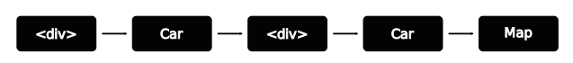

# React Next (Fiber і далі)

## Fiber
Це нова архітектура що покладена в основу React 16. Велика частина коду була переписана з нуля. Основною метою було створення можливості для пріоритизації оновлень. Перероблена система обробки помилок. Також були усунуті деякі старі незручності, як то необхідність обгортати деілька елементів в один корінний елемент, та деякі інші.  API, на щастя, майже не зачіпили.

## Демо
Розпочати знайомство кращє всього з проблеми що вона має на меті вирішити. Її добре видно на [демо](https://present-fiber-demo.herokuapp.com/). Демо синтетичне, симулює щось накшталт екрану диспетчерської таксі. На карті міста жовті машини. На машинах чорні числа, що вказують скільки машині щє їхати до точки призначення. Числа змінюються кожної секунди і під час цієї зміни анімація підлагує. Відбувається це через те, що в аплікації виконується дві паралельні дії: обробка анімації та оновлення DOM. Анімація працює добре аж до поки не стається массоване оновлення DOM. Щоб проблему було кращє видно введена штучна затримка, не забувайте що демо синтетичне але проблема цілком реальна. Поки переобраховується DOM анімаціє не програється, через те що всі ресурси покладено на роботу з DOM. І в старій архітектурі React, цю проблему не можна було вирішити ажніяк. Треба віддати належне розробникам бібліотеки. Вони зіткнувшись з цією проблемою (майже) повністю переписали код. І що важливо, майже не зачіпили API.
Забігаючи наперед скажу, що якщо натиснути на чекбокс зверху, то демо переключиться в режим **fiber** і перестане гальмувати. (Не залишайте демо надовго на самоті, бо воно казиться).

## Наразі
React, для забезпечення вискої швидкості роботи виористовує технологію Vitrual DOM: В пам'яті підтримується спрощена копія DOM і коли змінюється стан компоненту, відбувається процес *узгодження* (reconciliation). Процес узгодження складається з частин:
- Компоненти опитуються на рахунок змін у відповідь на зміну стану;
- DOM в пам'яті перебудовується;
- Обраховується різниця з реальним деревом DOM, та вносяться зміни.
Для узгодження використовується алгоритм, що його заднім числом назвали Stack. І в нього, з часом, виявився значний недолік: він працює простим пошуком в глибину і його робота неперервна. А оскільки в браузері все виконується в одному потоці, то під час узгодження, все інше має зачекати. В випаду високоприорітетних оновлень, наприклад анімаціі, це може стати відчутною неприємністю для користувача.

## Новий алгоритм узгодження (reconciliation)

### New Reconciliation Algorithm

### Compare


### Відкладені оновлення (deferred update)
```javascript
tick() {
  ReactDOM.unstable_deferredUpdates(() => (
    this.setState((prevState) => ({
      tick: prevState.tick + 1
    }))
  ))
}
```

- aware of multiple calls
- setState(object) - deprecated

## Fiber принцип

### Work broken up into chunks
```javascript
window.requestIdleCallback(callback[, options])
```
*Polyfilled if no browser support*

### Fiber Object

```javascript
{
  stateNode
  child
  return
  sibling
}
```

### Current tree


### workInProgress tree


### determining which nodes to upgrade


### cloning DOM nodes


### Effects List
Pending commit:


### Commit

### Подвійна буферизація


## Приоритизація

## Також

### Фрагменти (Fragments)

Відтепер, не обов'язково обгортати набір елементів, що повертає компонент, в один корневий елемент. Ви можете повертати масиви елементів, що дуже зручно в місцях, де неможливо просто обгорнути елементи в `<div>`. Наприклад в роботі з таблицями і списками, якщо компонент має повернути декілька рядків або елементів списку. Також можна повертати строки.

```javascript
const TableHeader = () => {
  return [
    <tr><th colspan="2">Автомобіль</th><th colspan="2">Водій</th></tr>,
    <tr><th>Номер</th><th>Марка</th><th>Позивний</th><th>Телефон</th></tr>,
  ]
}
```

### Кордони помилок (Error boundaries)

Запроваджена нова система обробки помилок. Тепер, якщо в компоненті виникає помилка, можна застосувати новий метод життєвого циклу `componentDidCatch`.

```javascript
class Map extends React.Component {
  constructor(props) {
    super(props)

    this.state = { hasError: false }
  }

  componentDidCatch(error, info) {
    this.setState(() => { hasError: true })
  }

  render() {
    if (this.state.hasError) {
      return <h1>Нажаль сталась прикра помилка.</h1>
    }
    return <MapContent />;
  }
}
```

### Портали (Portals)
Іноді виникає необхідність створити елемент не в рамках поточної ієрахії, а наприклад, як у випадку з модальними вікнами, приєднати до `<body>`. На допомогу приходять портали.

```javascript
render() {
  return ReactDOM.unstable_createPortal(<Modal />, domElement)
}
```

### Атрибути (Attributes)
React 16 дозволяє вам використовувати власні атрибути.
```javascript
<div hello='world' />
```

Атрибути що мають канонічне ім'я все одно валідуються. І вас буде попереджено, якщо ви використовуєте неправильне ім'я атрибута.
```javascript
// Warning: Invalid DOM property `tabindex`. Did you mean `tabIndex`?
<div tabindex="-1" />
```

Будьте обережні. Це означає що фільтрація атрибутів більше не виконується.
```javascript
<div myData='[Object object]' />
```

## Майбутнє

### Превізуалізація (pre-rendering)
Оскільки візуалізація розбита на дві фази, є можливість чітко знати, коли все необхідне завантажене, обраховане і готове до відображення. Це відкриває шлях, в майбутньому, до потокового завантаження превізуалізованих на сервері компонентів. Також спростити етап завантаження великих аплікацій.

### Абстракція
Мабуть ви знаєте що React наразі працює на великій кількості платформ, нпариклад:
- Браузер: React DOM
- Мобільні: react-native
- Термінал: react-blessed
- Віртуальна реальність: aframe-react
- Arduino: (react-hardware)

Команда React активно працює в напрямку того, щоб зробити React незалежним від оточення. З версії v0.14 ReactDOM був віділений до окремого пакету. З версії v0.16 розробники рапортують що React став (майже :)) повністю незалежний від браузера.

### Пріорітети оновлення

## Міграція

### Коли
Вже скоро. Наразі доступний другий реліз кандидат `v16.0.0-rc2` тому є висока ймовірність, що коли ви читаєте цю статтю, то `v16.0.0` вже в дії.

### Життєвий цикл компоненту
Будьте уважні та обережні, якщо ви використовуєте відкладені оновлення. Деякі методи життєвого циклу, під час одного оновлення, можуть викликатись двічі або більше разів. Це методи етапу узгодження (reconciliation).
- componentWillMount
- componentWillReceiveProps
- shouldComponentUpdate
- componentWillUpdate

Пов'язано це з тим, що оновлення може бути відкладено, через більш нагальні оновлення, а потім буде переобраховано.

Методи етапу чину (commit), викликаються тільки один раз.
- componentDidMount
- componentDidUpdate
- componentWillUnmount

### Помилки
Відтепер, з введенням кордонів помилок, React не намагається продовжувати роботу, у випадку помилки. Це покладається на ваші плечі. Якщо є необроблена помилка, яка доходить до верхнього рівня, дерево компонентів повністю перемонтується.

### Атрибути
React більше не видаляє незнайомі атрибути і вам бажано (але не необхідно) це зробити самим.

## Нижня лінія

### Посилання
- Код презентації та демо: http://github.com/yevhene/present-fiber
- Презентація: https://present-fiber.herokuapp.com/

### Ресурси
- [Lin Clark - A Cartoon Intro to Fiber - React Conf 2017](https://www.youtube.com/watch?v=ZCuYPiUIONs)
- [Keynote - Andrew Clark aka @acdlite at @ReactEurope 2017](https://www.youtube.com/watch?v=QW5TE4vrklU)
- [A tiny Fiber renderer- Dustan Kasten, React London 2017](https://www.youtube.com/watch?v=U9zFfIww3Go)


--
Starvation?
